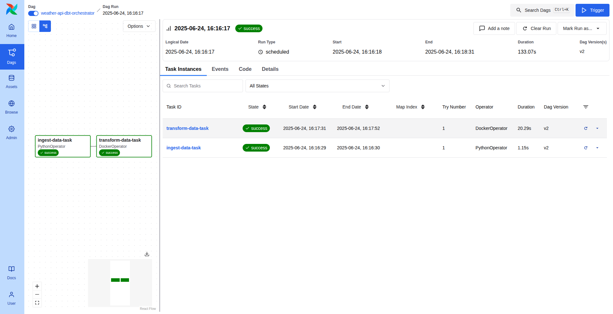

 <div align="left" style="position: relative;">

<h1>POSTGRES-AIRFLOW-DBT-PIPELINE</h1>
<p align="left">
	<em><code>A data pipeline to ingest realtime weather data from API, transform it and organize into marts for downstream analysis</code></em>
</p>


## 📍 The Airflow DAG

<code> 
  </code>

---


## 📁 Project Structure

```sh
└── postgres-airflow-dbt-pipeline/
    └── dbt_postgres_airflow
        ├── airflow
        │   └── dags
        │       ├── dbt_orchestrator.py
        │       └── orchestrator.py
        ├── dbt
        │   ├── dbt_project
        │   │   ├── .gitignore
        │   │   ├── dbt_project.yml
        │   │   └── models
        │   ├── first_dbt
        │   │   └── scripts
        │   └── profiles.yml
        └── postgres
            ├── airflow_init.sql
            └── docker-compose.yaml
```


### 📂 Project Index
<details open>
	<summary><b><code>POSTGRES-AIRFLOW-DBT-PIPELINE/</code></b></summary>
	<details> <!-- __root__ Submodule -->
		<summary><b>__root__</b></summary>
		<blockquote>
			<table>
			</table>
		</blockquote>
	</details>
	<details> <!-- dbt_postgres_airflow Submodule -->
		<summary><b>dbt_postgres_airflow</b></summary>
		<blockquote>
			<details>
				<summary><b>airflow</b></summary>
				<blockquote>
					<details>
						<summary><b>dags</b></summary>
						<blockquote>
							<table>
							<tr>
								<td><b><a href='https://github.com/saffirex/postgres-airflow-dbt-pipeline/blob/master/dbt_postgres_airflow/airflow/dags/dbt_orchestrator.py'>dbt_orchestrator.py</a></b></td>
								<td><code> combined into DAG in orchestrator.py</code></td>
							</tr>
							<tr>
								<td><b><a href='https://github.com/saffirex/postgres-airflow-dbt-pipeline/blob/master/dbt_postgres_airflow/airflow/dags/orchestrator.py'>orchestrator.py</a></b></td>
								<td><code>combines ingestion and transformation task into DAG</code></td>
							</tr>
							</table>
						</blockquote>
					</details>
				</blockquote>
			</details>
			<details>
				<summary><b>postgres</b></summary>
				<blockquote>
					<table>
					<tr>
						<td><b><a href='https://github.com/saffirex/postgres-airflow-dbt-pipeline/blob/master/dbt_postgres_airflow/postgres/docker-compose.yaml'>docker-compose.yaml</a></b></td>
						<td><code>start here making sure the paths exist</code></td>
					</tr>
					<tr>
						<td><b><a href='https://github.com/saffirex/postgres-airflow-dbt-pipeline/blob/master/dbt_postgres_airflow/postgres/airflow_init.sql'>airflow_init.sql</a></b></td>
						<td><code>initializes postgres db for airflow</code></td>
					</tr>
					</table>
				</blockquote>
			</details>
			<details>
				<summary><b>dbt</b></summary>
				<blockquote>
					<table>
					<tr>
						<td><b><a href='https://github.com/saffirex/postgres-airflow-dbt-pipeline/blob/master/dbt_postgres_airflow/dbt/profiles.yml'>profiles.yml</a></b></td>
						<td><code>dbt profiles</code></td>
					</tr>
					</table>
					<details>
						<summary><b>dbt_project</b></summary>
						<blockquote>
							<table>
							<tr>
								<td><b><a href='https://github.com/saffirex/postgres-airflow-dbt-pipeline/blob/master/dbt_postgres_airflow/dbt/dbt_project/dbt_project.yml'>dbt_project.yml</a></b></td>
								<td><code>dbt project yaml</code></td>
							</tr>
							</table>
							<details>
								<summary><b>models</b></summary>
								<blockquote>
									<details>
										<summary><b>sources</b></summary>
										<blockquote>
											<table>
											<tr>
												<td><b><a href='https://github.com/saffirex/postgres-airflow-dbt-pipeline/blob/master/dbt_postgres_airflow/dbt/dbt_project/models/sources/sources.yml'>sources.yml</a></b></td>
												<td><code>specifies sources</code></td>
											</tr>
											</table>
										</blockquote>
									</details>
									<details>
										<summary><b>mart</b></summary>
										<blockquote>
											<table>
											<tr>
												<td><b><a href='https://github.com/saffirex/postgres-airflow-dbt-pipeline/blob/master/dbt_postgres_airflow/dbt/dbt_project/models/mart/weather_report.sql'>weather_report.sql</a></b></td>
												<td><code>mart for weather report</code></td>
											</tr>
											<tr>
												<td><b><a href='https://github.com/saffirex/postgres-airflow-dbt-pipeline/blob/master/dbt_postgres_airflow/dbt/dbt_project/models/mart/daily_average.sql'>daily_average.sql</a></b></td>
												<td><code>mart for daily aggregated report</code></td>
											</tr>
											</table>
										</blockquote>
									</details>
									<details>
										<summary><b>staging</b></summary>
										<blockquote>
											<table>
											<tr>
												<td><b><a href='https://github.com/saffirex/postgres-airflow-dbt-pipeline/blob/master/dbt_postgres_airflow/dbt/dbt_project/models/staging/silver_weatherstack.sql'>silver_weatherstack.sql</a></b></td>
												<td><code>dupes removed and database cleaned</code></td>
											</tr>
											</table>
										</blockquote>
									</details>
								</blockquote>
							</details>
						</blockquote>
					</details>
					<details>
						<summary><b>first_dbt</b></summary>
						<blockquote>
							<details>
								<summary><b>scripts</b></summary>
								<blockquote>
									<table>
									<tr>
										<td><b><a href='https://github.com/saffirex/postgres-airflow-dbt-pipeline/blob/master/dbt_postgres_airflow/dbt/first_dbt/scripts/insert_records.py'>insert_records.py</a></b></td>
										<td><code>code to insert API data into db</code></td>
									</tr>
									<tr>
										<td><b><a href='https://github.com/saffirex/postgres-airflow-dbt-pipeline/blob/master/dbt_postgres_airflow/dbt/first_dbt/scripts/api_req.py'>api_req.py</a></b></td>
										<td><code>requests the API endpoint</code></td>
									</tr>
									</table>
								</blockquote>
							</details>
						</blockquote>
					</details>
				</blockquote>
			</details>
		</blockquote>
	</details>
</details>

---
